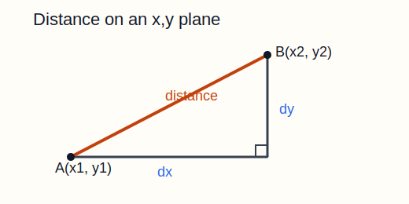
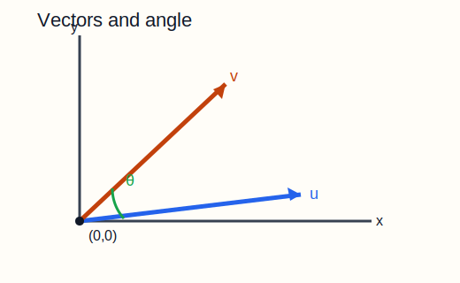
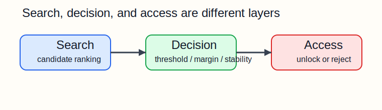
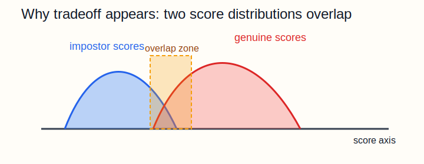

# Embedding Search Intuition（正體中文版）

[English Version](/tmp/SentriFace/docs/search/embedding_search_intuition.md)

這份文件用正體中文說明 embedding search 背後的幾何直覺與決策直覺，
目標讀者是數學程度大約在高中階段、願意慢慢理解的人。

這份文件其實也想完成一個更大的教學目標：
讓讀者慢慢感受到，高中數學不會停在 `x, y` 平面與考卷上的公式。
同樣是座標、距離、角度、投影這些熟悉觀念，也可以一路延伸到更大的
特徵空間（feature space），用來描述人臉、影像與其他真實世界訊號中的差異。

也想先說一句讓讀者安心的話：
如果你一開始覺得這種想法很不直觀，這是正常的。
要慢慢接受「抽象數學空間也能描述真實差異」這件事，往往需要長時間反覆接觸。
有些人很快就能進入這種思考方式，有些人要花好幾年才真正習慣；
這兩種情況都很正常。

這份中文版保留了關鍵技術名詞，因為讀者最後還是會在其他文件、論文、
程式碼、benchmark、log 中看到這些詞；但我會在第一次出現時就補上白話解釋，
讓讀者不是被術語擋住，而是順手把術語學起來。

本文件主要回答四類問題：

- `x, y` 平面上的距離，怎麼一路延伸到 face embedding？
- 為什麼 `normalized dot product`、`cosine similarity`、`Euclidean distance`
  常常會一起出現？
- 為什麼有了 search score，系統還不能直接開門？
- 為什麼 replay、enrollment quality、open-set rejection 會影響整個系統？

若你想看比較偏實作、執行期與封裝策略
（implementation / runtime / package strategy）的版本，請看：

- [dot_kernel_strategy.md](dot_kernel_strategy.md)

## 章節地圖

這份文件分成四層：

### 第 1 層：幾何基礎

- `從 x, y 距離一路走到 dot score`
- `餘弦相似度（Cosine Similarity）與歐式距離（Euclidean Distance）`
- `為什麼 512 維不會破壞直覺`

### 第 2 層：分數怎麼讀

- `門檻（Threshold）、邊界差（Margin）與決策直覺`
- `為什麼 search score 不是機率（probability）`
- `為什麼驗證（verification）和辨識（identification）不一樣`

### 第 3 層：決策與風險

- `為什麼最佳匹配（best match）仍然不夠直接解鎖`
- `為什麼 open-set rejection 很難`
- `為什麼 false accept / false reject 是取捨（tradeoff）`

### 第 4 層：驗證與系統思維

- `為什麼註冊品質（enrollment quality）會改變整個幾何`
- `為什麼重播驗證（replay）比直覺更重要`

## 建議閱讀順序

如果你是第一次接觸這個主題，這個順序通常最順：

1. 從 `x, y` 距離一路走到 dot score
2. 餘弦相似度（Cosine Similarity）與歐式距離（Euclidean Distance）
3. 門檻（Threshold）、邊界差（Margin）與決策直覺
4. 為什麼 `512` 維不會破壞直覺
5. 為什麼 search score 不是機率（probability）
6. 為什麼驗證（verification）和辨識（identification）不一樣
7. 為什麼最佳匹配（best match）仍然不夠直接解鎖
8. 為什麼 open-set rejection 很難
9. 為什麼 false accept / false reject 是取捨（tradeoff）
10. 為什麼註冊品質（enrollment quality）會改變整個幾何
11. 為什麼重播驗證（replay）比直覺更重要

## 從 `x, y` 距離一路走到點積分數（Dot Score）

### 1. 這一節要回答什麼？

這一節真正要回答的是三個問題：

- 人臉最後為什麼可以變成一個向量？
- 兩個向量為什麼可以用 dot product 比？
- 這整件事為什麼仍然是我們熟悉的幾何，而不是神祕黑魔法？

如果先把這三個問題抓住，後面的公式就不會像突然掉下來。

### 2. 從高中最熟的距離公式開始

假設平面上有兩點：

- `A = (x1, y1)`
- `B = (x2, y2)`

它們在水平方向差了：

- `dx = x2 - x1`

在垂直方向差了：

- `dy = y2 - y1`

所以兩點距離就是：

先記住這個式子：

```text
distance = sqrt(dx^2 + dy^2)
```

也就是：

```text
distance = sqrt((x2 - x1)^2 + (y2 - y1)^2)
```

這其實只是畢氏定理換成座標寫法而已。

### 3. 一張很簡單的圖



這張圖的重要意義不是畫得漂亮，而是提醒你：

- 距離公式不是憑空記憶
- 它是直角三角形直接推出來的

### 4. 從 2 維延伸到很多維

如果在 `3D`，公式變成：

```text
distance = sqrt(dx^2 + dy^2 + dz^2)
```

如果一路延伸到 `n` 維，公式只是繼續照同一個模式長下去：

```text
distance = sqrt((a1 - b1)^2 + (a2 - b2)^2 + ... + (an - bn)^2)
```

請特別注意這件事：

- 維度變多了
- 規則沒有變

這是整份文件最重要的核心觀念之一：

- 高維幾何仍然是幾何

### 5. 什麼是向量？

向量可以先把它想成：

- 從原點出發的一支箭頭

例如：

- `u = (3, 4)`

就可以想成從 `(0, 0)` 指向 `(3, 4)` 的箭頭。

它的長度就是：

```text
|u| = sqrt(3^2 + 4^2) = 5
```

所以「向量長度」其實也是距離：

- 原點到箭頭尖端的距離

### 6. 第二張圖：把向量看成箭頭



這個箭頭圖很重要，因為它讓我們把一個向量拆成兩件事來想：

- 這支箭頭有多長？
- 這支箭頭朝哪個方向？

稍後你會看到，dot product 很在意第二件事。

### 7. Dot Product 先看起來只是算術規則

如果有兩個向量：

- `u = (u1, u2, ..., un)`
- `v = (v1, v2, ..., vn)`

那麼它們的 dot product 定義是：

```text
u · v = u1v1 + u2v2 + ... + unvn
```

在 `2D` 就是：

```text
(x1, y1) · (x2, y2) = x1x2 + y1y2
```

例如：

```text
(3, 4) · (6, 8) = 3*6 + 4*8 = 50
```

第一次看到這個公式時，很多人都會想：

- 為什麼是這樣乘再這樣加？

這個反應很正常。
下一步真正要做的，就是把它和幾何連起來。

### 8. Dot Product 為什麼和角度有關？

一個非常重要的關係式是：

先記住這個式子：

```text
u · v = |u||v|cos(theta)
```

其中 `theta` 是兩個向量之間的夾角。

這個式子在講什麼？

- 如果兩個向量方向很接近，`cos(theta)` 接近 `1`
- 如果兩個向量互相垂直，`cos(theta)` 等於 `0`
- 如果兩個向量幾乎反方向，`cos(theta)` 會接近 `-1`

所以 dot product 不是隨便發明的一個乘法。
它其實在衡量：

- 兩支箭頭方向有多一致

### 9. 一個慢慢推導的版本

如果你想知道上面的關係式不是怎麼被「宣告」出來，而是怎麼來的，
可以看這個推導。

先看兩個向量尖端之間的距離，也就是 `|u - v|`。

從座標展開：

```text
|u - v|^2 = (u1 - v1)^2 + (u2 - v2)^2 + ... + (un - vn)^2
```

展開平方後可以得到：

```text
|u - v|^2 = |u|^2 + |v|^2 - 2(u · v)
```

另一方面，從三角形的餘弦定理可得：

```text
|u - v|^2 = |u|^2 + |v|^2 - 2|u||v|cos(theta)
```

兩邊都在描述同一件幾何量，所以可以對照出：

```text
u · v = |u||v|cos(theta)
```

這就是連接：

- 座標算術
- 三角形幾何
- 角度直覺

的關鍵橋樑。

### 10. 第三張圖：角度直觀


如果 `theta` 小，表示兩支箭頭方向接近，dot product 會比較大。

### 11. 還有另一個很直觀的說法：影子

想像向量 `u` 在向量 `v` 的方向上投影。

- 如果 `u` 大部分都朝 `v` 的方向，投影會很長
- 如果 `u` 幾乎垂直於 `v`，投影會很短

所以 dot product 也可以理解成：

- 這支箭頭有多少「順著另一支箭頭方向」的成分

### 12. Raw Dot Product 為什麼有時會誤導？

看這兩組：

- `(1, 0)` 和 `(1, 0)`
- `(10, 0)` 和 `(1, 0)`

它們方向其實完全一樣，但：

```text
(1, 0) · (1, 0)  = 1
(10, 0) · (1, 0) = 10
```

為什麼第二個大這麼多？

因為 raw dot product 同時把兩種東西混在一起了：

- 方向
- 長度

這是一個非常重要的教學時刻。
因為它讓我們發現：

- dot product 很有幾何意義
- 但 raw dot product 不一定在回答我們真正想問的問題

### 13. Normalization 是什麼？

把向量 normalize，意思是用它自己的長度去除它：

```text
u_normalized = u / |u|
```

normalize 之後，每個向量的長度都變成 `1`。

這時候：

```text
u_normalized · v_normalized = cos(theta)
```

也就是說：

- 長度影響被拿掉了
- 分數主要只在看方向相不相近

這就是為什麼很多 embedding system 會特別強調：

- normalized dot product
- cosine similarity

### 14. 一個小例子：正、零、負

令：

- `u = (3, 4)`
- `v = (6, 8)`
- `w = (4, -3)`
- `t = (-3, -4)`

那麼：

```text
u · v > 0
u · w = 0
u · t < 0
```

意思分別是：

- 正：大致同方向
- 零：垂直
- 負：反方向

### 15. Normalized Dot Product 與距離其實連在一起

對 normalized 向量，有一個很漂亮的關係式：

先記住這個式子：

```text
|u - v|^2 = 2 - 2(u · v)
```

這句話很值得慢慢看。

因為它表示：

- dot product 越大
- 距離越小

換句話說，normalize 之後：

- 「哪兩個向量方向最接近」

和

- 「哪兩個點距離最近」

其實在講同一個幾何結構。

### 16. 這和 face embedding 有什麼關係？

face embedding 不是原始影像本身，而是模型產生的向量表示。

系統希望做到的是：

- 同一人的照片，向量方向彼此接近
- 不同人的照片，向量方向彼此較分開

所以當系統比較 normalized face embeddings 時，它其實是在問：

- 這兩張臉經過模型轉成向量後，方向有多接近？

### 17. 小結

這一節可以壓縮成這幾句：

- 距離在看兩點有多遠
- 向量讓我們同時看長度與方向
- dot product 在看方向一致程度
- normalization 把長度影響拿掉
- 所以 normalized dot product 很適合拿來做 embedding similarity

## 餘弦相似度（Cosine Similarity）與歐式距離（Euclidean Distance）

### 1. 這一節要回答什麼？

很多人到這裡會自然產生一個問題：

- 我們到底是在看角度，還是在看距離？

這看起來像兩件不同的事。

這一節要回答的是：

- 什麼時候 cosine similarity 和 Euclidean distance 真的不同？
- 什麼時候它們會變得很接近？
- 為什麼有些文件用 cosine，有些文件用 distance，但其實在講差不多的東西？

### 2. 一開始它們確實不同

最基本地說：

- Euclidean distance 問的是「兩點相隔多遠？」
- cosine similarity 問的是「兩個向量方向多一致？」

這本來就是不同問題。
所以如果讀者一開始覺得：

- 這兩個概念怎麼會被放在一起講？

這個疑問完全合理。

### 3. 一個會分歧的例子

令：

- `a = (1, 0)`
- `b = (10, 0)`

這兩個向量方向完全相同，所以：

```text
cosine(a, b) = 1
```

但它們的距離是：

```text
|a - b| = 9
```

一個說：

- 完全同方向

另一個說：

- 還是離很遠

這不是矛盾，而是因為它們在注意不同東西。

### 4. 它們各自在看什麼？

在上面的例子裡：

- cosine 在看方向
- Euclidean distance 在看位置加大小

所以在 normalize 之前，兩者可能說出不同故事。

### 5. Normalization 改變了關係

一旦我們把向量 normalize 成長度 `1`，大小影響就被拿掉了。

這時候有：

先記住這個式子：

```text
|u - v|^2 = 2 - 2cosine(u, v)
```

所以 normalize 之後：

- cosine 越大，距離越小
- cosine 越小，距離越大

### 6. 所謂「等價」真正是什麼意思？

很多人說：

- normalize 後 cosine 和 distance 等價

這通常不是指：

- 兩個數字長得一模一樣

而是指：

- 排名結果通常一樣

也就是：

- cosine 最高的候選

通常也是：

- distance 最小的候選

### 7. 為什麼實作常偏好 normalized dot product？

幾何上它們很接近，但 implementation 上，normalized dot product 往往更自然。

因為它很適合做這種重複動作：

```text
讀 query 一段
讀 prototype 一段
相乘
相加
重複
```

這很適合：

- batch scoring
- `contiguous matrix`
- CPU 的向量化指令，例如 `SIMD`

這裡的 `SIMD` 可以先把它想成：

- CPU 一次處理多個數值的加速方式

### 8. 為什麼不同來源會用不同詞？

你會看到有些資料寫：

- `cosine similarity`

有些寫：

- `inner product`

有些寫：

- `L2 distance`

這很容易讓初學者覺得整個領域很混亂。

這裡先記住一個比較安全的說法：

- 在一般 Euclidean 向量空間裡，`dot product` 是最常見的一種 `inner product`
- 所以很多實作文件會把兩者講得很近，但嚴格來說它們不必完全等同

很多時候，特別是在 normalize 過的 embedding pipeline 裡，
它們描述的是非常接近的幾何。

### 9. 常見誤解

- 如果一個來源說 cosine、另一個來源說 Euclidean distance，那一定是兩套完全不同的系統。

比較安全的理解是：

- 先看它有沒有 normalize。
- 很多時候，normalize 之後它們其實是在從不同角度描述同一個鄰近結構。

### 10. 小結

- normalize 前，cosine 與 Euclidean distance 可以分歧
- normalize 後，它們會緊密連在一起
- 在 search 裡，這通常意味著它們給出相同排名
- 在實作上，normalized dot product 常更方便

## 門檻（Threshold）、邊界差（Margin）與決策直覺

### 1. 這一節要回答什麼？

很多人會覺得：

- 既然系統已經算出分數了
- 那不就是挑最高分就好了？

這一節就是要說明：

- 為什麼事情沒有那麼簡單

更具體地說：

- 為什麼 top-1 score 不夠？
- 為什麼 threshold 和 margin 要同時存在？
- 為什麼影片流還需要 temporal smoothing？

### 2. 分數是證據，不是裁決

score 本身不等於：

- accept

它只是整體證據的一部分。

在 access control 裡，完整問題通常更像是：

- 第一名分數夠不夠高？
- 第一名和第二名差得夠不夠開？
- 這個結果是否連續幾幀都穩？
- crop quality 好不好？
- liveness 是否可信？

### 3. Threshold 在回答什麼？

threshold 的典型形式是：

先記住這個規則：

```text
accept only if top-1 >= threshold
```

它問的是：

- 第一名夠不夠強？

所以 threshold 比較像一條門檻線，而不是自然界真理。

### 4. 為什麼 top-1 不夠？

看兩個例子：

- `top-1 = 0.82, top-2 = 0.81`
- `top-1 = 0.82, top-2 = 0.42`

第一名分數一樣，但意義完全不同：

- 第一種很擠，很有爭議
- 第二種很乾淨，第一名明顯勝出

### 5. Margin 在回答什麼？

最簡單的 margin 是：

先記住這個式子：

```text
margin = top1 - top2
```

它問的是：

- 第一名是不是明顯領先？

所以：

- threshold 在看「夠不夠強」
- margin 在看「贏得夠不夠乾淨」

### 6. 第四張圖：同樣 top-1，不同 margin

```text
Case A: contested

top-1  0.82
top-2  0.81

Case B: clean

top-1  0.82
top-2  0.42
```

這張圖的重點是：

- 同一個 top-1，不代表同一種風險

### 7. Temporal Smoothing 在回答什麼？

影片和單張圖不同，因為影片可以累積時間證據。

單張圖容易被下面這些事情干擾：

- blur
- head motion
- alignment jitter
- lighting variation

所以 temporal smoothing 在問的是：

- 這個判斷是不是連續一段時間都穩？

### 8. 一個很實用的三句模型

- threshold 看絕對強度
- margin 看相對分離度
- temporal smoothing 看時間穩定度

這三句話非常值得記住。

### 9. 常見誤解

- 只要 top-1 很高，margin 和 temporal evidence 都只是次要細節。

比較安全的理解是：

- 一個看起來很高的 top-1，仍然可能很擠、很晃、或整體證據不足。

### 10. 小結

- top-1 在回答「誰贏了」
- threshold 在回答「贏得夠不夠強」
- margin 在回答「贏得夠不夠乾淨」
- temporal smoothing 在回答「這個贏法穩不穩」

## 為什麼 `512` 維不會破壞直覺

### 1. 這一節要回答什麼？

很多人不是卡在公式，而是卡在感覺：

- `x, y` 我能理解
- `512D` 聽起來很不真實

這一節要回答：

- 為什麼高維仍然可以理解？
- 什麼直覺還能保留？
- 什麼直覺要小心使用？

### 2. 最先要記住的安定句

從 `2D` 走到 `512D` 時：

- 規則沒變
- 只是人比較畫不出來

我們仍然在做同樣的事情：

- 比座標
- 算長度
- 看角度
- 比距離

### 3. 第五張圖：人畫不出 512D，但公式沒變

```text
2D  --->  3D  --->  ...  --->  512D

畫圖能力：   容易      還可以        不可能直接畫
數學規則：   一樣      一樣          還是一樣
```

### 4. 為什麼每個維度不一定有人類可命名意義？

在 embedding 裡，一個座標通常不會直接對應成：

- 眼距
- 鼻高
- 下巴寬

這很正常。

真正重要的是：

- 整個向量排列起來，能不能把同一人放近、不同人放遠

不過，對初學者來說，先用比較有畫面的方式理解，通常是有幫助的。

你完全可以先暫時想像：

- 有些維度大概像是在描述兩眼距離
- 有些維度大概像是在描述兩眼到鼻頭的相對距離
- 有些維度組合像是在描述臉部輪廓
- 有些維度和嘴形、眼角形狀有關
- 有些維度可能和痣，或其他很細小的特徵有關
- 甚至有些差異是一般人平常不會特別注意，但數學上仍然能拿來區分人的

這樣想不是說：

- 模型真的嚴格地「一維對應一種五官特徵」

而是先幫自己搭一座理解的橋。

換句話說：

- 這是一種幫助讀者接受概念的比擬法
- 它不是模型內部真正的逐維標註地圖
- 但它抓到的方向仍然是接近的，因為模型確實是在把很多能區分人的細小差異編進數學表示

### 5. 「很多弱線索一起工作」是比較好的理解

與其想像每一維都有一個漂亮的人類意義，
更好的想法往往是：

- 很多弱線索一起形成整體表示

所以比較安全的心智模型是：

- 有些維度，或某些維度組合，看起來好像在描述眼距、鼻子、輪廓、嘴形、
  眼角、痣，或其他細微差異
- 但模型通常不是把它們整整齊齊地分成「一維一特徵」
- 它更像是把很多弱線索分散地編織在整個向量裡

### 6. 為什麼 normalize 後的 unit sphere 圖像仍有幫助？

normalize 後，每個向量長度都是 `1`，
所以你可以把它想成它們都坐在同一個高維球面上。

雖然人畫不出真正的 `512D` 球面，
但這個圖像仍然有概念價值：

- 方向近，表示相似
- 角度大，表示差異更大

### 7. 為什麼高維有時反而是幫助？

高維不是一定更亂。

從模型角度看，高維常常代表：

- 有更多空間把不同 identity 分開

這不保證完美辨識，但它解釋了：

- 為什麼很多 embedding system 會使用較高維度

對高中生來說，這裡還有一個更值得帶走的觀念：

- 數學不只是在方格紙上解題
- 數學也可以把真實世界的細微差異整理成可比較的表示

很多人第一次接觸 feature space 時會覺得它很陌生，
但其實它不是另一套完全無關的魔法。
它更像是把你本來就認識的距離、角度、投影、座標觀念，
慢慢延伸到人比較畫不出來、但仍然可以推理的空間。

所以這一節的目標不是要你真的「看見」`512` 維，
而是讓你先接受一件更重要的事：

- `512` 維雖然難畫
- 但它仍然可以被有條理地推理

如果你到這裡還是覺得它有點不自然，也完全不用緊張。
真正難的地方不只是新公式，而是要慢慢習慣：

- 抽象表示可以對應到真實差異
- 這種對應不一定每一維都很直觀
- 但它仍然可以是可驗證、可比較、可運算的

這種接受通常不是靠一句話突然開悟，
而是靠很多次例子、很多次回頭看，才慢慢建立起來。

### 8. 常見提醒

- 不要把 `512D` 過度想成「只是放大版的方格紙」

比較安全的理解是：

- 核心公式和幾何關係完全延伸
- 但人類視覺化能力沒有跟著延伸

### 9. 小結

- 高維拿走的是容易畫圖的能力
- 它沒有拿走距離、角度、長度、normalize 這些幾何關係

## 為什麼 Search Score 不是機率（Probability）

### 1. 這一節要回答什麼？

很多人看到一個分數像：

- `0.82`

會立刻想成：

- 系統有 82% 把握

這一節要回答：

- 這種直覺為什麼常常是錯的？
- 分數真正有用的意義是什麼？

### 2. 為什麼這個誤解很自然？

因為人很容易把 `0 ~ 1` 之間的平滑數字看成：

- 百分比
- 信心值
- 機率

這種直覺很自然，但不代表正確。

### 3. Probability 真正代表什麼？

如果它真的是 probability，`0.82` 應該接近表示：

- 真實正確率大約是 82%

這是一個很強的主張。
它需要：

- calibration
- 標註資料
- 實際統計驗證

這裡的 `calibration` 可以先白話理解成：

- 檢查 `0.60`、`0.80`、`0.95` 這種數字，是否真的對應到那樣的正確率

### 4. Search Score 在這裡真正表示什麼？

在這條 search path 裡，分數比較誠實的理解是：

- 在既定 embedding + normalization 定義下的幾何相似程度

它回答的是：

- 這個 query 和這個 stored identity representation 有多接近？

它不是自動回答：

- 這個身分主張有幾% 機率是真的？

### 5. Threshold 不會把分數魔法般變成機率

即使你設定：

```text
accept if score >= 0.75
```

也不代表：

- 系統在 75% sure 時就接受

它只表示：

- 在這個系統、這些資料、這些條件下，`0.75` 表現得像一條實用門檻

### 6. 同一個數字在不同系統裡可能不是同一件事

同樣是 `0.80`，不同系統的意義可能差很多，因為它取決於：

- embedding model
- normalization consistency
- enrolled roster
- camera quality
- enrollment quality
- genuine / impostor 分布

這裡的 `roster` 指的是：

- 系統目前存著的 enrolled identities 集合

### 7. Margin 為什麼能幫我們保持誠實？

比較這兩個情況：

- `top-1 = 0.84, top-2 = 0.83`
- `top-1 = 0.84, top-2 = 0.40`

第一名分數一樣，但意義完全不同。
這提醒我們：

- 分數不能脫離上下文單獨解讀

### 8. 常見誤解

- 如果 score 是 `0.82`，系統就是 82% sure。

比較安全的理解是：

- 這是幾何相似度的證據，不是系統自帶的 probability。

### 9. 小結

- similarity score 很有用
- 但它的用處是提供幾何證據
- 它不是自動校準好的機率

## 為什麼驗證（Verification）和辨識（Identification）不一樣

### 1. 這一節要回答什麼？

很多人第一次聽到這兩個詞時會以為差不多。

其實它們在問的是不同問題：

- verification：你說你是誰，我檢查是不是
- identification：你沒先說你是誰，我從名單裡找最像的人

### 2. Verification：檢查一個既有主張

verification 問的是：

- `Is this person really the claimed identity?`

這裡的 `claim` 指的是：

- 使用者或系統已經先提出的可能身分

例如：

- 刷 badge
- 輸入 user ID
- 系統已知現在在驗哪個人

所以 verification 比較像：

- `1:1`

### 3. Identification：在名單中搜尋

identification 問的是：

- `Who is this person among the enrolled identities?`

這裡沒有先驗身分主張（prior claim）。

系統必須先從整個名單裡找候選人（candidate）。

所以 identification 比較像：

- `1:N`

### 4. 這個差異為什麼重要？

verification 比較像在問：

- 這個 claim 有沒有過關？

identification 比較像在問：

- 名單裡誰最像？
- 這個最像的人是否可信到可以接受？

所以 identification 自然會帶出：

- top-1
- top-2
- margin
- open-set rejection

### 5. 為什麼 identification 自然會變成 ranking 語言？

因為它同時在比較很多可能性，所以你會一直看到：

- top-1
- top-2
- top-k
- margin

verification 的語言則比較像：

- pass
- fail
- accept
- reject the claim

### 6. 常見誤解

- identification 只是把 verification 重複做很多次。

比較安全的理解是：

- 它們可能共享同一個 embedding backbone，也就是同一個負責產生 embedding 的主幹模型
- 但 identification 額外帶有 search、ranking、open-set rejection 的負擔

### 7. 小結

- verification 在問「這個人是否符合這個 claim？」
- identification 在問「名單裡誰最像？」

它們可以共用 embedding，但不是同一個任務。

## 為什麼最佳匹配（Best Match）仍然不夠直接解鎖（Unlock）

### 1. 這一節要回答什麼？

初學者常會問：

- 系統既然已經找出最像的人，為什麼還不能直接開門？

這一節的重點就是：

- best match 只是 ranking 結果
- unlock 是真實世界行動

這兩者不是同一層。

### 2. Search 在回答比較問題

search 問的是：

- 現有已註冊候選人（enrolled candidates）裡，誰最像？

unlock 問的是：

- 這個結果是否可信到可以觸發 access？

所以可以用一句話記：

- search 在做 comparison
- unlock 在做 commitment

### 3. Top-1 只代表「目前候選裡第一名」

永遠都會有 top-1。
但那不代表：

- top-1 一定值得接受

一個很好的類比是：

- 四選一題目裡，四個選項都不好時，你還是能選出「最不差」的一個

### 4. 第六張圖：Search、Decision、Access 是不同層



### 5. 常見誤解

- 只要 top-1 出來了，就代表 identity 已經確認。

比較安全的理解是：

- top-1 只表示目前候選中誰最像
- 它不自動保證夠強、夠乾淨、夠穩，也不保證鏡頭前一定是真人活體（live person）

### 6. 為什麼 liveness / anti-spoof 不是 similarity 內部自然解決的？

similarity 在問：

- 這張臉像不像某個 enrolled identity？

但它不會自動回答：

- 這是一個真實活體嗎？

所以：

- search
- liveness
- final decision

通常是並列但不同的子問題。

### 7. 為什麼 reject 有時是正確成功？

如果證據不夠，系統拒絕 unlock 可能正是它最成功的地方。

這提醒我們：

- access control 不是只在追求 accept 變多
- 它是在追求可辯護的決策

### 8. 小結

- best match 只是候選人（candidate）
- decision 才是在判斷是否可信
- unlock 是更後面的真實行動

## 為什麼 Open-Set Rejection 很難

### 1. 這一節要回答什麼？

search 找到最近的候選人（nearest candidate）之後，真正困難的問題常常才開始：

- 如果最近的人仍然是錯的，怎麼辦？

這個問題叫：

- `open-set rejection`

這裡的 `open-set` 可以先白話理解成：

- 正確答案可能在名單裡
- 也可能根本不在名單裡

### 2. 為什麼 open-set 比課堂題目難？

在很乾淨的課堂例子裡，我們常假設：

- 正確答案一定在 enrolled set 中

但真實系統不是這樣。
鏡頭前的人可能是：

- 已註冊的人
- 未註冊的人
- 偷拍畫面
- 螢幕回放
- 品質很差的樣本

### 3. Search 回傳的是幾何建議，不是身份真理

很好的記法是：

- search output 是一個幾何上的建議：誰看起來最近

它不是：

- 身分真理的最終宣告

### 4. 為什麼 nearest-neighbor 會形成心理陷阱？

因為 nearest-neighbor 幾乎總會吐出某個結果。

人就很容易誤以為：

- 既然系統有答案，答案一定很有意義

但有時它只是在說：

- 這是目前最不差的一個

### 5. 為什麼 `unknown` 是成功狀態？

如果這個人根本不在 enrolled set 裡，那麼：

- `unknown`

反而是最正確、最誠實的輸出。

### 6. 為什麼不能只靠單一訊號？

open-set rejection 往往得同時看：

- absolute score
- margin
- temporal stability
- crop quality
- liveness

因為不同壞案例會壞在不同地方。

### 7. 為什麼這些錯誤有時看起來還很像真的？

最危險的錯誤不是那種一眼就荒謬的錯。

比較危險的是：

- 看起來有點像
- 分數不算太差
- 短時間還算穩

這種錯很容易騙過粗糙直覺。

### 8. 為什麼 rejection policy 必須靠真實資料測？

光有幾何故事還不夠。

團隊還必須看：

- genuine scores，也就是真實同人分數，通常落在哪
- impostor scores，也就是冒名或非同人分數，通常落在哪
- overlap 多不多
- borderline case 長什麼樣

所以 rejection policy 不是只從理論推導出來的。
它同時需要：

- geometry
- validation
- product risk judgment

### 9. 小結

- 最難的地方常常不是找候選人（candidate）
- 而是知道什麼時候不該相信你找到的那個候選人

## 為什麼 False Accept / False Reject 是取捨（Tradeoff）

### 1. 這一節要回答什麼？

很多人第一次聽到：

- false accept
- false reject

會直覺覺得這是兩個獨立 bug。

但這一節要說的是：

- 它們很多時候是同一條 decision boundary 的兩面

### 2. 先用人話定義

false accept：

- 不該放進來的人被放進來了

false reject：

- 本來該通過的人被擋掉了

### 3. Threshold 為什麼天然形成 tradeoff？

如果你把 threshold 拉高：

- false accept 可能下降
- 但 false reject 可能上升

如果你把 threshold 放低：

- false reject 可能下降
- 但 false accept 可能上升

### 4. `Operating point` 是什麼意思？

你會看到技術文件常說：

- `operating point`

這裡可以先白話理解成：

- 系統從哪裡開始說 pass、從哪裡開始說 fail

所以 tuning threshold 常常不是：

- 讓一切都更好

而是：

- 在不同風險之間選一個平衡點

### 5. 第七張圖：兩個分布重疊



只要 genuine 和 impostor 分布有 overlap，就很難同時把兩邊都做到完美。

### 6. 常見誤解

- 把 threshold 調高就是在「修掉 false accept」。

比較安全的理解是：

- 更嚴格的 threshold 可能減少某些 false accept
- 但也可能把一些 genuine case 推成 false reject

### 7. 為什麼 margin 和 temporal smoothing 也是 tradeoff 工具？

margin 拉高可能：

- 減少 ambiguous accepts

但也可能：

- 讓一些真的人因為贏得不夠乾淨而被拒絕

temporal smoothing 也類似：

- 穩定性提高
- 但 accept 變慢，甚至短暫有效片段被拒

### 8. 為什麼團隊常常低估 false accept？

因為 false reject 通常很明顯，測試者會立刻抱怨。

false accept 在 casual demo 中反而不一定常出現，
但它可能更危險。

### 9. 為什麼沒有 universal best threshold？

因為不同產品風險偏好不同。

例如：

- 高安全門禁可能更偏保守
- 低風險便利流可能願意更寬鬆

### 10. 小結

- false accept 與 false reject 常是同一條 decision boundary 的兩面
- 很多 tuning 其實是在移動 tradeoff，不是在單向修 bug

## 為什麼 Enrollment Quality 會改變整個幾何

### 1. 這一節要回答什麼？

很多人會把 enrollment 想成：

- 收幾張圖
- 存起來
- 完成

但其實 enrollment 在做的是：

- 建立後續 search 會一直拿來比較的 reference geometry

### 2. `Anchor` 是什麼？

這一節會常看到：

- `anchor`

這裡可以先白話理解成：

- 後續 query 會拿來對照的已儲存參考點

### 3. `Baseline` 是什麼？

這一節也會看到：

- `baseline`

這裡可以先把它理解成：

- 後續 adaptation / history 還沒加進來之前，最早且最信任的起始參考

### 4. 為什麼弱 enrollment 會讓後面一切都變差？

如果一開始存進去的原型向量（prototype）品質就不好，後面會一起受影響：

- genuine score，也就是真實同人分數，拉不高
- margin 不乾淨
- temporal smoothing 比較難穩
- adaptive update 容易長歪

### 5. 一個常見的錯誤診斷

團隊可能看到執行期分數（runtime score）不漂亮，就直覺以為：

- threshold 太高
- model 不夠 discriminative

這裡的 `discriminative` 可以先白話理解成：

- 模型把不同人分開的能力夠不夠強

但真正更深層的問題可能只是：

- 一開始存進去的 anchor 就不好

### 6. 第八張圖：地圖與地標

```text
embedding space = 地圖
prototype       = 地標
search          = 找最近地標
```

如果地標放錯地方，後面導航再努力也會很辛苦。

### 7. Representative sample 為什麼比「看起來漂亮」更重要？

一張圖看起來很美，不代表它是好 anchor。

更重要的往往是：

- 大小夠不夠
- 是否居中
- alignment 穩不穩
- 是否代表真實部署條件（deployment conditions）

### 8. Multiple prototypes 為什麼不是越多越好？

一個人有多個原型向量（prototype）常常是有幫助的，
因為同一個人可能有：

- 輕微姿態變化
- 輕微光線變化
- 自然外觀變動

但如果你把低品質樣本亂加進去，identity region
也就是這個人所在的幾何區域，也會變得更雜亂。

### 9. 為什麼 artifact preservation 很有價值？

如果你保存了：

- accepted frame
- face crop
- summary data

那麼之後討論 enrollment quality 就不只是在猜。

### 10. 常見誤解

- enrollment 一旦完成，後面問題就都是 threshold 問題。

比較安全的理解是：

- enrollment quality 在上游
- 它會影響 score、margin、temporal behavior，甚至 debug 方式

### 11. 小結

- enrollment quality 是 identity geometry 的起點
- 很多後面的 decision 問題，其實可能一開始就埋在 enrollment 裡

## 為什麼重播驗證（Replay）比直覺更重要

### 1. 這一節要回答什麼？

很多人會問：

- 如果我們已經可以現場 demo、可以看分數、也能形成直覺，為什麼還需要 replay？

這一節的答案是：

- 直覺有價值，但不夠穩
- replay 能把證據固定下來

### 2. 直覺有什麼價值？

直覺很適合幫我們發現：

- 這段好像不穩
- 這版好像變慢
- 這個 margin 好像怪怪的

它很擅長：

- noticing

但不擅長：

- proving

### 3. Replay 真正帶來什麼？

replay 的關鍵價值是：

- 把證據固定住

所以團隊可以公平問：

- 同一批輸入，不同版本會怎樣？
- 同一批輸入，不同 threshold 會怎樣？
- 同一批輸入，不同後端實作（backend）會怎樣？

### 4. 第九張圖：Intuition、Replay、Validation

```text
intuition  -> notice
replay     -> check
validation -> decide
```

這三句幾乎可以當口訣。

### 5. 為什麼沒有 replay，調參很容易變成講故事？

因為沒有固定證據時，團隊很容易開始說：

- 我覺得這版比較穩
- 昨天 demo 看起來比較強
- 這個改動應該有幫助

這些話可能不是假的，但很難真正驗證。

### 6. 為什麼 replay 對細微改進（subtle improvement）特別重要？

有些改進不是 dramatic 的，而是：

- margins 稍微健康一點
- identity flips 少一點
- borderline negatives 更穩定地被拒掉
- `scalar` 與 `SIMD` 輸出更一致

這裡的 `scalar` 可以先理解成：

- 最簡單、一步一步算的版本

而 `SIMD` 是：

- CPU 一次處理多個數值的優化版本

### 7. 為什麼 replay 也幫助未來的維護者？

replay 不只幫今天調 bug 的人，也幫未來的人回答：

- 為什麼這個 threshold 被選成這樣？
- 哪些 case 曾經很難？
- 不同版本修訂（revision）之間到底變了什麼？

### 8. 為什麼 replay 不等於取代現場測試？

replay 很重要，但它不取代：

- 現場相機測試（live camera testing）
- RTSP 測試
- 目標硬體驗證（target hardware validation）

比較健康的說法是：

- replay 讓我們對現實的推理更有紀律

### 9. 常見誤解

- 只要經驗夠多、demo 看得夠仔細，replay 就只是加分項。

比較安全的理解是：

- 經驗幫你注意到模式
- replay 幫你把模式變成可檢查、可比較、可重播的證據

### 10. 小結

- intuition 幫你 notice
- replay 幫你 check
- validation 幫你 decide

## 收尾總結

整份文件最核心的圖像是：

1. 人臉影像（face image）先被模型轉成 embedding 向量（embedding vector）
2. 向量會被 normalize，讓方向成為主訊號
3. search 用 dot-product similarity 來排序候選人
4. threshold、margin、replay 幫助我們讀懂與驗證這些分數
5. decision layer 仍然必須處理不確定性（ambiguity）、拒絕（rejection）、
   活體（liveness）與 access risk

如果你讀完整份文件只想帶走三件事，最值得帶走的是：

1. normalized dot-product search 仍然是普通幾何，只是延伸到很多維
2. 找到第一名候選人（candidate），不等於已經可以安全授權
3. 好的調參（tuning）依賴 replay 與 validation，不依賴 demo 當下的印象

這份文件其實還想再多送讀者一個比較大的想法：

1. 一張人臉可以被整理成很多數字
2. 這些數字可以被看成更大空間中的座標
3. 高中熟悉的距離、角度、normalize，仍然能幫我們在那個空間裡推理

所以學這份文件的價值不只是懂一個人臉辨識系統。
它也在幫讀者開始接觸一種更大的數學觀：

- 數學不只是解課本題目
- 數學也可以描述真實世界中的特徵與差異

這也是為什麼讀這份文件時，不需要要求自己立刻完全直覺化。
有些人很快就能進入這種思考方式，
有些人要經過很多次回頭看、很多次練習，才會慢慢覺得自然。
這份文件的目的不是逼讀者瞬間開悟，
而是提供一條可以反覆回來走的路，讓抽象概念慢慢變得可用。

如果你想用每一層一句話來記：

1. Geometry：
   記住，normalized dot-product search 仍然是普通幾何。
2. Score interpretation：
   記住，score 是證據，不是 probability。
3. Decision and risk：
   記住，最佳候選人（best candidate）不自動等於可接受候選人。
4. Validation：
   記住，replay 是把直覺變成 evidence 的方法。
